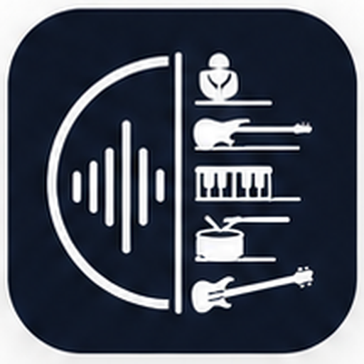

<!-- SPDX-License-Identifier: MIT -->
<p align="center">
  
</p>

<h1 align="center">PlayPart</h1>

<p align="center"><em>Extract · Mute · Play</em></p>

<p align="center">
  A self-hosted web app for musicians who want to practice songs by separating them
  into instrument stems and playing along.
</p>

<p align="center">
  <a href="LICENSE"></a>
  
  
</p>

---

PlayPart takes any track you upload, separates it into 6 stems (drums, bass, guitar,
vocals, piano, other) with [Demucs](https://github.com/facebookresearch/demucs), and
gives you a web mixer to learn it: mute the instrument you want to play, loop a
passage, slow it down without changing pitch, transpose by semitones, attach the
score, and save your settings.

It's designed to **run on your own machine on the LAN** — your laptop, a home server
or NAS. No accounts, no cloud, no telemetry.

## Features

**Library**
- Upload `mp3` / `wav` / `flac` / `m4a` / `ogg`
- Nested folders, drag-free move via a `Déplacer…` menu
- Per-track notes (instrument settings, gear chain…)
- Per-track file attachments — partitions PDF, Guitar Pro `.gp4/.gp5/.gpx`, anything;
  PDFs preview inline in the browser

**Mixer**
- Synchronized playback of all 6 stems, volume / mute / solo per stem
- Master volume per song, persisted
- Tempo-aware **countdown click** before starting playback
- Mix settings (master / volumes / mutes) persisted per song

**Practice tools**
- **A/B loop** with visual markers on the timeline
- **Slow down** to 0.5× or 0.75× — pitch preserved
- **Transpose** ± 6 semitones — drums kept original; the other 5 stems are
  pre-rendered server-side once per pitch, then served instantly from cache

**Audio analysis**
- Auto-detected **tempo** (`librosa.beat.beat_track`)
- Auto-detected **key** (Krumhansl-Schmuckler), editable from the UI

**Hardware**
- Uses an NVIDIA GPU automatically when available, falls back to CPU otherwise
- On CPU, the extraction defaults to `shifts=1` to keep jobs bearable; overridable
  via the `DEMUCS_SHIFTS` env var

## Quick start (Docker)

Two pre-built variants live behind two compose files. Pick the one matching your host:

```bash
# CPU-only host
docker compose -f docker-compose.cpu.yml up -d --build

# GPU host (requires the NVIDIA Container Toolkit)
docker compose up -d --build
```

Then open **http://&lt;host&gt;:8765** from any device on the LAN.

The container persists everything (uploaded tracks, stems, SQLite db, demucs model
cache) in a single volume — by default `./appdata` next to the compose file.

## Local development

```bash
# 1. Backend
pip install -r backend/requirements.txt
uvicorn backend.main:app --host 0.0.0.0 --port 8765 --reload

# 2. Frontend (in another terminal)
cd frontend
npm install
npm run dev      # Vite dev server with HMR on :5173
```

When you're done iterating, `npm run build` produces a static bundle in
`frontend/build/` that the FastAPI process serves automatically on the same port as
the API.

## Stack

- **Backend** — FastAPI · SQLite · `ProcessPoolExecutor(1)` worker with the Demucs
  model pre-loaded · `librosa` for tempo, key and pitch shifting · `soundfile` for
  WAV I/O · `lameenc` for MP3
- **Frontend** — SvelteKit + `adapter-static` (single-page app) · raw Web Audio API
  for synchronized stem playback and click generation
- **Architecture** — single port: API under `/api/...`, the SPA is served as a
  fallback for everything else. No reverse proxy needed for a personal setup.

## Configuration

| Env var          | Default | Purpose                                                |
|------------------|---------|--------------------------------------------------------|
| `MUSICAPP_DATA`  | `./data` | Root directory for tracks, stems, attachments, DB     |
| `TORCH_HOME`     | system  | Used as the Demucs model cache directory              |
| `DEMUCS_SHIFTS`  | auto    | Override the shift count for extraction (1–10 typical)|

## Acknowledgements

PlayPart leans on a few excellent open-source projects: **Demucs** (Meta) for the
source separation, **librosa** for the analysis, **FastAPI** + **SvelteKit** for the
plumbing. Thanks to their authors.

## Security note

PlayPart has **no authentication**. Run it on a trusted LAN only. If you want to
expose it to the public Internet, put it behind a reverse proxy with basic-auth or a
forward auth provider — or accept that anyone who finds the URL can upload, delete
and download your tracks.

## License

MIT — see [`LICENSE`](LICENSE).
